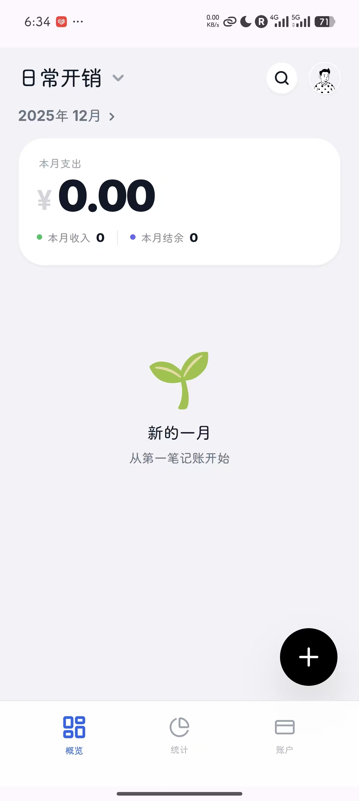
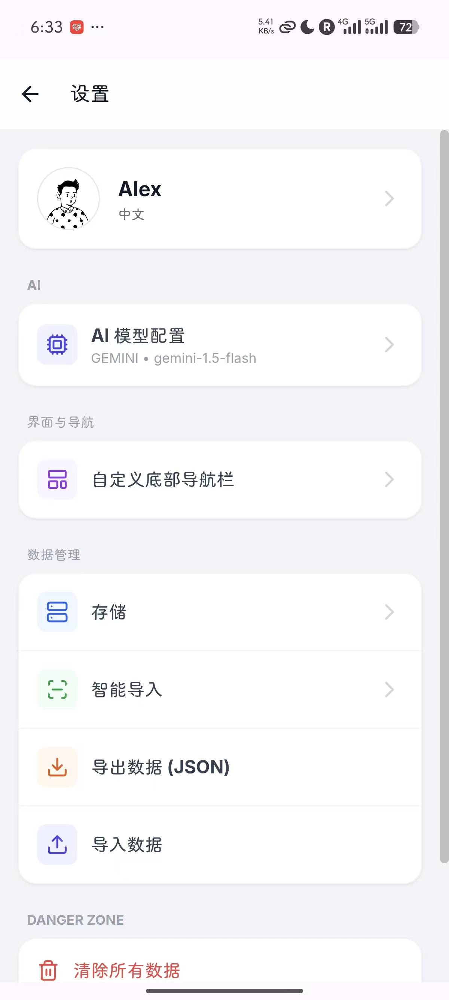
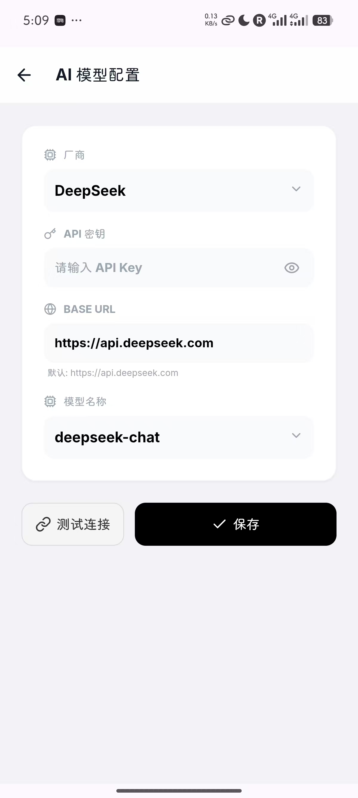

<div align="center">
  <a href="https://github.com/shzbzjhsnsja/JotBill">
    
  </a>

  <h1 align="center">JotBill</h1>

  <p align="center">
    <strong>Minimalist. Local-First. AI-Powered.</strong>
  </p>

  <p align="center">
    <a href="./README_CN.md">🇨🇳 中文文档</a>
    &nbsp; | &nbsp;
    <a href="./README.md">🇺🇸 English</a>
  </p>

  <p align="center">
    <a href="https://github.com/shzbzjhsnsja/JotBill/blob/main/LICENSE">
      
    </a>
    <a href="#">
      
    </a>
    <a href="#">
      
    </a>
  </p>
</div>

---

## 📖 Introduction

**JotBill** (Chinese Name: 小记一笔) is a minimalist, privacy-focused bookkeeping application designed for users who value data sovereignty. 

Unlike traditional finance apps that force cloud sync, JotBill operates on a **Local-First** architecture. It combines the performance of a **Native Android Shell** with the flexibility of a **Web Core**. 

With built-in **AI integration (BYOK)**, it helps you analyze spending habits through chat, all while keeping your data strictly on your device.

## ✨ Key Features

* **🔒 Privacy First:** No servers, no tracking. All data is stored locally on your device (IndexedDB + SQLite).
* **🤖 AI-Powered Analysis:** Support for DeepSeek and compatible OpenAI APIs. Chat with your ledger to get financial insights.
* **🔑 BYOK Architecture:** **Bring Your Own Key**. Your API keys are stored securely on your device and never uploaded.
* **☁️ Data Sync:** Support for WebDAV (NextCloud, Synology NAS, etc.). Keep your data safe with your own private cloud.
* **📥 Smart Import:** * OCR Screenshot Parsing
    * WeChat/Alipay Bill Import (CSV Parsing)

## 📸 Screenshots

<div align="center">
  
  
  
</div>

## 🛠️ Tech Stack

This project demonstrates a **Hybrid Mobile Architecture**:

* **Android Shell:** Kotlin, Jetpack, WebView Integration.
* **Core Logic (Web):** TypeScript, HTML5, CSS3.
* **Data Storage:** IndexedDB (Web side) + SharedPreferences (Android side).
* **AI Integration:** Custom RESTful API implementation for LLMs.

## 🚀 Getting Started

### Prerequisites
* Android Studio Ladybug or newer.
* Node.js & npm (for building the web core).

### Installation

1.  **Clone the repo:**
    ```bash
    git clone [https://github.com/shzbzjhsnsja/JotBill.git](https://github.com/shzbzjhsnsja/JotBill.git)
    cd JotBill
    ```

2.  **Run Android App:**
    * Open the project folder in Android Studio.
    * Sync Gradle and Run on your emulator or device.

## 🤝 Contributing

Pull requests are welcome! For major changes, please open an issue first to discuss what you would like to change.

## 📄 License

This project is licensed under the MIT License - see the [LICENSE](LICENSE) file for details.
